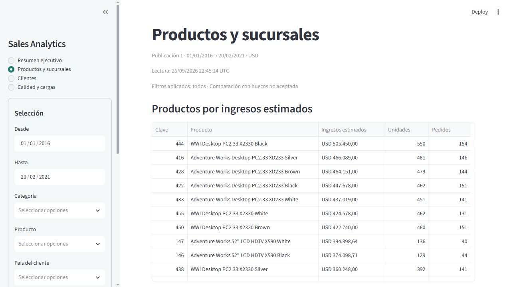
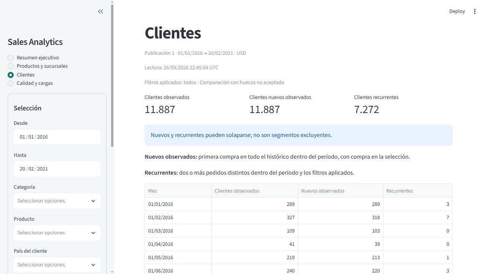
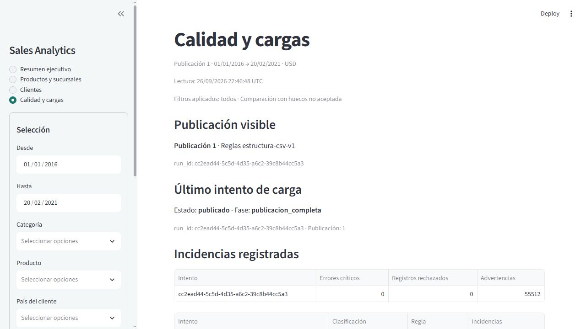

# Sales Analytics Platform — portafolio técnico

## Contexto y problema

Proyecto local de ingeniería y análisis construido con el dataset Global Electronics Retailer de Maven Analytics. La necesidad es convertir archivos independientes de ventas, clientes, productos, sucursales y tasas en indicadores trazables, sin confundir calidad del origen con resultados comerciales.

El alcance implementado comprende extracción CSV, validación, transformación, PostgreSQL y dashboard Streamlit. No incluye APIs, cloud, CI/CD, ML ni despliegue productivo. Las cifras representan el snapshot del proyecto, no resultados de una empresa operada por el autor.

## Decisiones y desafíos

El [diagrama del README](../README.md#arquitectura) resume la separación de responsabilidades. La biblioteca estándar interpreta CSV, fechas, hashes e importes Decimal; Psycopg maneja PostgreSQL. Se prefirieron funciones concretas frente a un ORM o servicios genéricos. Streamlit consulta la publicación y nunca dispara el ETL.

**Preservación y calidad.** Cada archivo se identifica por los bytes efectivamente procesados y se conserva en staging antes de validar su semántica. Customers requiere Windows-1252; los demás, UTF-8. Vacíos, espacios, NA y ceros iniciales permanecen en el origen textual. El diccionario se verifica sin crear una sexta tabla de staging. Las incidencias vinculan intento, archivo, ordinal y regla; cero errores críticos y cero rechazos es condición de publicación. El snapshot contiene 55.512 advertencias que se conservan: una advertencia no equivale a un registro rechazado.

**Modelo.** La tabla de hechos representa una línea de pedido; cliente, producto y sucursal usan claves sustitutas, mientras la dimensión fecha usa DATE como clave natural. Online se identifica mediante StoreKey=0. Los importes de referencia USD se fijan por línea sin aplicar tipos de cambio. Esto permite conciliaciones exactas pero no reconstruye precios transaccionales ausentes.

**Atomicidad e idempotencia.** Un bloqueo de publicación serializa escritores. Tras adquirirlo, se vuelven a comprobar snapshot, conflictos y autorizaciones. Datos e identidad visible se confirman juntos. Repetir el snapshot vigente conserva claves e importes y registra una ejecución sin cambios; un snapshot histórico que reaparece no se trata automáticamente como repetición vigente.

**Concurrencia y recuperación.** Las pruebas sincronizan publicadores de forma determinista. Fallos después de modificar dimensiones, tasas y hechos comprueban el rollback completo. Los diagnósticos se registran fuera de esa transacción; si PostgreSQL está inaccesible, la evidencia local se identifica expresamente. La recuperación manual distingue proceso activo, interrupción y commit incierto; no existe un servicio automático de recuperación. Tipo 1 y revaloración autorizada se probaron únicamente con datos sintéticos.

**SQL y presentación.** Cuatro vistas —ventas_base, pedidos, clientes_primera_compra y sucursales— alimentan K1–K10. Los nuevos usan primera compra global, la recurrencia se calcula después de filtrar y los conteos distintos no son aditivos. Las fórmulas permanecen en SQL. Una actualización lógica del dashboard usa la misma conexión de solo lectura y REPEATABLE READ para filtros, cifras y metadatos; termina antes de renderizar. Un error no expone resultados parciales.

## Resultados del snapshot

| Medida | Resultado conciliado |
|---|---:|
| Líneas de venta | 62.884 |
| Pedidos distintos | 26.326 |
| Unidades registradas | 197.757 |
| Ingresos estimados | USD 55.755.479,59 |
| Costos estimados | USD 23.092.791,21 |
| Margen estimado | USD 32.662.688,38 |

Estas referencias son pruebas de regresión del snapshot aprobado; no limitan futuras cargas. Las conciliaciones iniciales independientes constan en [E5](e5_execution.md). El [perfil](data_profile.md) documenta nulos, advertencias y cobertura temporal; las [reglas](business_rules.md) definen fórmulas y ejemplos bajo filtros.

## Verificación

Cierre E9 del 27/09/2026: **347 pruebas aprobadas**, cero fallos y cero omisiones, en **612,88 s**: 157 unitarias, 180 de integración y 10 UI. El recorrido end-to-end pasó en **318,82 s** dentro de esa suite. La prueba integral ejecuta extracción, staging, validación, publicación, consulta consistente y equivalencia SQL/UI sobre los originales en una base aislada. Repite el snapshot y provoca un fallo antes del commit con un producto sintético adicional en una copia temporal local. No modifica los originales ni revalora productos reales.

El entorno limpio de E9 instaló los 51 paquetes fijados desde requirements.lock con hashes obligatorios y el proyecto local sin resolver dependencias adicionales. No se añadieron dependencias en E9. Los ajustes cosméticos tienen pruebas específicas de idioma, fechas y conservación del timestamp interno.

Resultados adicionales ejecutados: Ruff lint aprobado, Ruff format check aprobado (55 archivos), `pip check` sin conflictos en ambos entornos y 51 versiones instaladas coincidentes con el lock. Tras la suite y la navegación, PostgreSQL registró **cero conexiones residuales** a las tres bases del proyecto. La comparación de firmas completas de DW, staging y auditoría en ambas bases de aceptación no encontró diferencias; los seis SHA-256 coinciden con el perfil inicial.

La primera ejecución integral encontró un timeout de consulta; la repetición pasó sin ampliar límites. La corrección conserva fechas ordenables mediante DateColumn, además del timestamp interno. Los logs y XML completos permanecen locales en `.verification/e9-final-tests.log`, `e9-final-tests.xml`, `e9-final-state.json`, `e9-preservation-final.log` y `e9-security-final.json`.

## Archivos de E9

Creados: `tests/integration/test_end_to_end.py`, esta documentación, `docs/local_setup.md` y las cuatro capturas en `docs/images/`. Modificados: `README.md`, `.env.example`, `docs/implementation_plan.md`, el enlace de resultados en `docs/e5_execution.md`, `src/sales_analytics/dashboard.py` y `tests/ui/test_dashboard.py`. `.gitignore` se verificó sin necesitar cambios. No se alteraron las reglas, el modelo, los CSV ni las dependencias. La [estructura final](../README.md#estructura) mantiene el único proyecto Python.

## Integridad y publicaciones preservadas

Las dos publicaciones de aceptación conservan estado `publicado`, fase `publicacion_completa` y `publication_id=1`, con los conteos e importes de la tabla anterior. `sales_analytics_test` mantiene además su intento previo `80a0553f-5555-40e6-9913-9e6961d4cfe4` en `sin_cambios`, sin identidad de publicación. E9 no creó intentos en ninguna de estas dos bases. Sus identidades publicadas son:

| Base | run_id publicado |
|---|---|
| sales_analytics | cc2ead44-5c5d-4d35-a6c2-39c8b44cc5a3 |
| sales_analytics_test | c72eb197-9913-4015-97be-761003d5064d |

SHA-256 de los seis originales, contrastados con el perfil inicial:

| Archivo | SHA-256 |
|---|---|
| Customers.csv | `B508818AC86FAE2059BD315C38A76396C3BB2FCBDFCE3217A1C436BF2A4638EB` |
| Data_Dictionary.csv | `69611363F84302D1D4B294EE4A29B9C6DDEB68F6634CC630FCF9F266EC174769` |
| Exchange_Rates.csv | `9B46644A0035DAE4D6FED174523A2B2DEDCC733157C78AF6B57A839E0DEA39B8` |
| Products.csv | `D6BA42DB0AA64C547A2F1F5A3E73CC19E6B1260C4702767A003A11CA2927A4FE` |
| Sales.csv | `15CE9165098227714A2470341495855B55D31539773B85B86AC68A6DEE6F9A53` |
| Stores.csv | `21EBB499C905037CCF12A3602D2C47C4BF6C5EF706FBA3A4FBC6EBA34E5CBDF0` |

## Seguridad y reproducción

La revisión de los 66 archivos candidatos a publicación no encontró coincidencias con las credenciales locales reales, patrones de claves privadas/tokens ni rutas personales absolutas. Se comprobaron siete rutas de exclusión representativas: `.env`, `.env.secret`, `.local/admin.password`, los dos entornos virtuales, `Data/Sales.csv` y un log de `.verification`. Las cuatro capturas JPEG se inspeccionaron visualmente y los enlaces locales de la documentación resuelven. Esta revisión estática no es una auditoría de seguridad integral.

En E9 las exclusiones se comprobaron con metadatos Git temporales dentro de `.verification`. La revisión pre-publicación inicializó después Git local para inspeccionar el índice exacto, sin commits, remotos ni publicación de archivos o datos. La [guía local](local_setup.md) contiene comandos relativos y separa instalación nueva de operación sobre bases existentes.

## Rendimiento y limitaciones

E8 midió **12,65 s** y **17,02 s** por ciclo sobre las publicaciones de aceptación. Los límites configurados son conexión 5 s, consulta 40 s, inactividad en transacción 5 s y ciclo total 60 s. No se realizó prueba de carga multiusuario. En la primera ejecución integral E9 una consulta alcanzó su límite de 40 s; se conserva el fallo como evidencia, sin presentar esos tiempos como garantía de latencia.

Los ingresos, costos y margen usan catálogo: faltan precios efectivos, descuentos, impuestos, devoluciones y costos históricos. Febrero de 2021 es parcial y no muestra crecimiento mensual estándar. Las causas de huecos y la orientación comercial de Exchange no están demostradas. Las dimensiones Tipo 1 no conservan historia SCD2. La implementación y el lock se comprobaron en Windows x64/Python 3.13.0/PostgreSQL 17.11; no se afirma portabilidad verificada a otros entornos.

## Capturas finales

Las capturas corresponden a la publicación real aprobada, con cifras agregadas y sin credenciales.

### Resumen ejecutivo

### Productos y sucursales

### Clientes

### Calidad y cargas

## Aprendizajes

Preservar el origen antes de interpretar evita perder evidencia. Separar advertencias de rechazos permite mantener datos válidos sin ocultar sus límites. La atomicidad protege al lector solo si la identidad se confirma con los datos y toda la lectura comparte una instantánea. Los ejemplos pequeños bajo filtros detectan errores que un total global correcto puede ocultar. Una instalación reproducible necesita comprobar el lock y la aplicación instalada, además de ejecutar los tests sobre el código fuente.

El proyecto queda sujeto a revisión técnica local. Publicar código o cualquier artefacto en GitHub requiere autorización posterior; el dataset y los secretos permanecen excluidos.
